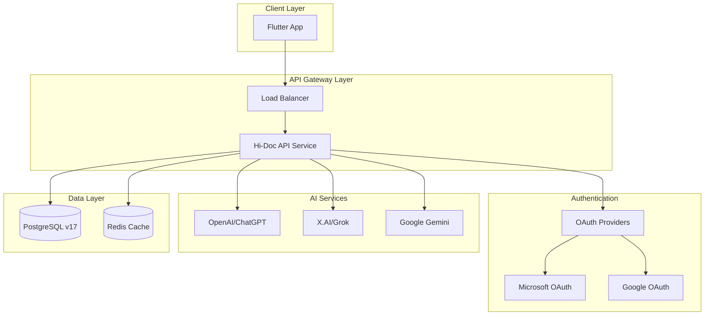
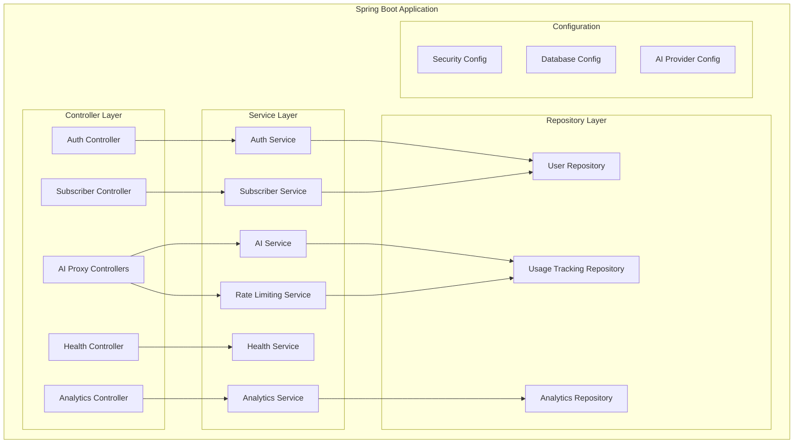

# Hi-Doc API Service Design Document

## Overview

The Hi-Doc API Service is a Java Spring Boot application designed to serve as a secure, scalable API layer for the Hi-Doc Flutter application. The service provides subscriber management, AI service proxying with rate limiting, and health data processing capabilities while maintaining security by keeping AI service API keys server-side.

The architecture leverages Java 25's virtual threading capabilities for optimal performance, PostgreSQL v17 for data persistence, and Spring Boot's latest features for modern application development.

## Architecture

### High-Level Architecture



### Component Architecture



## Components and Interfaces

### 1. Authentication and Security Components

#### OAuth Integration Service
```java
@Service
public class OAuthValidationService {
    public AuthenticatedUser validateToken(String token, OAuthProvider provider);
    public boolean isTokenValid(String token);
    public UserInfo extractUserInfo(String token);
}
```

#### Security Configuration
```java
@Configuration
@EnableWebSecurity
public class SecurityConfig {
    @Bean
    public SecurityFilterChain filterChain(HttpSecurity http);
    @Bean
    public OAuth2ResourceServer resourceServer();
}
```

### 2. Subscriber Management Components

#### Subscriber Entity
```java
@Entity
@Table(name = "subscribers")
public class Subscriber {
    @Id
    private String userId;
    private String email;
    private String oauthProvider;
    private String subscriptionStatus;
    private LocalDateTime purchaseDate;
    private String appStorePlatform;
    private LocalDateTime createdAt;
    private LocalDateTime updatedAt;
}
```

#### Subscriber Service
```java
@Service
public class SubscriberService {
    public Subscriber createOrUpdateSubscriber(SubscriberRequest request);
    public Optional<Subscriber> findByUserId(String userId);
    public AnalyticsReport generateSubscriberAnalytics(AnalyticsFilter filter);
}
```

### 3. AI Service Proxy Components

#### AI Provider Configuration
```java
@ConfigurationProperties(prefix = "ai.providers")
public class AIProviderConfig {
    private OpenAIConfig openai;
    private GrokConfig grok;
    private GeminiConfig gemini;
}
```

#### AI Service Interface
```java
public interface AIService {
    AIResponse processRequest(AIRequest request, AIProvider provider);
    boolean isProviderAvailable(AIProvider provider);
    AIProviderStatus getProviderStatus();
}
```

#### Rate Limiting Service
```java
@Service
public class RateLimitingService {
    public boolean isRequestAllowed(String userId);
    public void recordRequest(String userId, AIProvider provider);
    public UsageStats getUserUsageStats(String userId);
    public void resetMonthlyCounters();
}
```

### 4. Health Data Processing Components

#### Health Data Entity
```java
@Entity
@Table(name = "health_data_entries")
public class HealthDataEntry {
    @Id
    private String id;
    private String userId;
    private String type;
    private String category;
    private String value;
    private String unit;
    private LocalDateTime timestamp;
    private String notes;
}
```

#### Health Data Service
```java
@Service
public class HealthDataService {
    public HealthDataEntry processHealthMessage(String message, String userId);
    public HealthDataEntry saveHealthData(HealthDataEntry entry);
    public TrendAnalysis generateTrendAnalysis(TrendRequest request);
}
```

### 5. Health Check and Monitoring Components

#### Health Check Service
```java
@Service
public class HealthCheckService {
    public SystemHealthStatus getSystemHealth();
    public DatabaseHealthStatus checkDatabaseHealth();
    public AIServicesHealthStatus checkAIServicesHealth();
    public boolean isSystemHealthy();
}
```

#### Health Check Controller
```java
@RestController
@RequestMapping("/health")
public class HealthController {
    @GetMapping
    public ResponseEntity<HealthResponse> getHealth();
    
    @GetMapping("/detailed")
    public ResponseEntity<DetailedHealthResponse> getDetailedHealth();
    
    @GetMapping("/ready")
    public ResponseEntity<ReadinessResponse> getReadiness();
    
    @GetMapping("/live")
    public ResponseEntity<LivenessResponse> getLiveness();
}
```

#### Health Response Models
```java
public class HealthResponse {
    private String status; // UP, DOWN, DEGRADED
    private LocalDateTime timestamp;
    private String version;
    private Map<String, String> components;
}

public class DetailedHealthResponse extends HealthResponse {
    private DatabaseHealth database;
    private AIServicesHealth aiServices;
    private SystemMetrics metrics;
}
```

## Data Models

### Database Schema

#### Users Table
```sql
CREATE TABLE subscribers (
    user_id VARCHAR(255) PRIMARY KEY,
    email VARCHAR(255) NOT NULL UNIQUE,
    oauth_provider VARCHAR(50) NOT NULL,
    subscription_status VARCHAR(50) NOT NULL DEFAULT 'ACTIVE',
    purchase_date TIMESTAMP,
    app_store_platform VARCHAR(50),
    created_at TIMESTAMP DEFAULT CURRENT_TIMESTAMP,
    updated_at TIMESTAMP DEFAULT CURRENT_TIMESTAMP
);
```

#### Usage Tracking Table
```sql
CREATE TABLE usage_tracking (
    id BIGSERIAL PRIMARY KEY,
    user_id VARCHAR(255) NOT NULL,
    ai_provider VARCHAR(50) NOT NULL,
    request_timestamp TIMESTAMP DEFAULT CURRENT_TIMESTAMP,
    success BOOLEAN NOT NULL DEFAULT true,
    error_message TEXT,
    month_year VARCHAR(7) NOT NULL, -- Format: YYYY-MM
    FOREIGN KEY (user_id) REFERENCES subscribers(user_id)
);
```

#### Health Data Entries Table
```sql
CREATE TABLE health_data_entries (
    id VARCHAR(255) PRIMARY KEY,
    user_id VARCHAR(255) NOT NULL,
    type VARCHAR(100) NOT NULL,
    category VARCHAR(100) NOT NULL,
    value TEXT NOT NULL,
    unit VARCHAR(50),
    timestamp TIMESTAMP NOT NULL,
    notes TEXT,
    created_at TIMESTAMP DEFAULT CURRENT_TIMESTAMP,
    FOREIGN KEY (user_id) REFERENCES subscribers(user_id)
);
```

#### Analytics Aggregation Table
```sql
CREATE TABLE analytics_summary (
    id BIGSERIAL PRIMARY KEY,
    metric_type VARCHAR(100) NOT NULL,
    metric_value BIGINT NOT NULL,
    dimension_1 VARCHAR(100),
    dimension_2 VARCHAR(100),
    period_start TIMESTAMP NOT NULL,
    period_end TIMESTAMP NOT NULL,
    created_at TIMESTAMP DEFAULT CURRENT_TIMESTAMP
);
```

#### Health Check Data Models
```java
public class DatabaseHealth {
    private String status;
    private long connectionCount;
    private long responseTimeMs;
    private String version;
}

public class AIServicesHealth {
    private Map<String, AIProviderHealth> providers;
}

public class AIProviderHealth {
    private String status;
    private long responseTimeMs;
    private String lastError;
    private LocalDateTime lastChecked;
}

public class SystemMetrics {
    private long memoryUsed;
    private long memoryTotal;
    private double cpuUsage;
    private long uptime;
    private int activeThreads;
}
```

### API Request/Response Models

#### AI Request Model
```java
public class AIRequest {
    private String message;
    private AIProvider provider;
    private String userId;
    private Map<String, Object> metadata;
}
```

#### AI Response Model
```java
public class AIResponse {
    private String reply;
    private HealthDataEntry healthDataEntry;
    private String storedId;
    private boolean persisted;
    private String reasoning;
    private List<Map<String, Object>> matches;
}
```

## Error Handling

### Exception Hierarchy
```java
@ResponseStatus(HttpStatus.UNAUTHORIZED)
public class AuthenticationException extends RuntimeException {}

@ResponseStatus(HttpStatus.TOO_MANY_REQUESTS)
public class RateLimitExceededException extends RuntimeException {}

@ResponseStatus(HttpStatus.SERVICE_UNAVAILABLE)
public class AIServiceUnavailableException extends RuntimeException {}

@ResponseStatus(HttpStatus.BAD_REQUEST)
public class InvalidRequestException extends RuntimeException {}
```

### Global Exception Handler
```java
@ControllerAdvice
public class GlobalExceptionHandler {
    @ExceptionHandler(AuthenticationException.class)
    public ResponseEntity<ErrorResponse> handleAuthenticationException(AuthenticationException ex);
    
    @ExceptionHandler(RateLimitExceededException.class)
    public ResponseEntity<ErrorResponse> handleRateLimitException(RateLimitExceededException ex);
    
    @ExceptionHandler(AIServiceUnavailableException.class)
    public ResponseEntity<ErrorResponse> handleAIServiceException(AIServiceUnavailableException ex);
}
```

### Error Response Format
```java
public class ErrorResponse {
    private String error;
    private String message;
    private int status;
    private LocalDateTime timestamp;
    private String path;
}
```

## Testing Strategy

### Unit Testing
- **Service Layer Testing**: Mock external dependencies (AI services, database)
- **Repository Testing**: Use @DataJpaTest with embedded PostgreSQL
- **Controller Testing**: Use @WebMvcTest with MockMvc
- **Security Testing**: Test OAuth token validation and authorization

### Integration Testing
- **Database Integration**: Test with TestContainers PostgreSQL
- **AI Service Integration**: Mock AI service responses for consistent testing
- **End-to-End API Testing**: Test complete request flows with @SpringBootTest

### Performance Testing
- **Load Testing**: Test virtual threading performance under concurrent load
- **Rate Limiting Testing**: Verify rate limiting accuracy under high concurrency
- **Database Performance**: Test query performance with realistic data volumes

### Test Configuration
```java
@TestConfiguration
public class TestConfig {
    @Bean
    @Primary
    public AIService mockAIService() {
        return Mockito.mock(AIService.class);
    }
    
    @Bean
    @Primary
    public OAuthValidationService mockOAuthService() {
        return Mockito.mock(OAuthValidationService.class);
    }
}
```

## Performance Considerations

### Virtual Threading Configuration
```java
@Configuration
public class VirtualThreadConfig {
    @Bean
    public TaskExecutor taskExecutor() {
        return new VirtualThreadTaskExecutor("ai-proxy-");
    }
    
    @Bean
    public AsyncConfigurer asyncConfigurer() {
        return new AsyncConfigurer() {
            @Override
            public Executor getAsyncExecutor() {
                return Executors.newVirtualThreadPerTaskExecutor();
            }
        };
    }
}
```

### Database Connection Pooling
```java
@Configuration
public class DatabaseConfig {
    @Bean
    public HikariDataSource dataSource() {
        HikariConfig config = new HikariConfig();
        config.setMaximumPoolSize(50);
        config.setMinimumIdle(10);
        config.setConnectionTimeout(30000);
        config.setIdleTimeout(600000);
        config.setMaxLifetime(1800000);
        return new HikariDataSource(config);
    }
}
```

### Caching Strategy
```java
@Configuration
@EnableCaching
public class CacheConfig {
    @Bean
    public CacheManager cacheManager() {
        RedisCacheManager.Builder builder = RedisCacheManager
            .RedisCacheManagerBuilder
            .fromConnectionFactory(redisConnectionFactory())
            .cacheDefaults(cacheConfiguration());
        return builder.build();
    }
}
```

## Security Implementation

### OAuth Token Validation
```java
@Component
public class JwtAuthenticationFilter extends OncePerRequestFilter {
    @Override
    protected void doFilterInternal(HttpServletRequest request, 
                                  HttpServletResponse response, 
                                  FilterChain filterChain) throws ServletException, IOException {
        String token = extractToken(request);
        if (token != null && oAuthValidationService.isTokenValid(token)) {
            Authentication auth = createAuthentication(token);
            SecurityContextHolder.getContext().setAuthentication(auth);
        }
        filterChain.doFilter(request, response);
    }
}
```

### API Key Management
```java
@Component
@ConfigurationProperties(prefix = "ai.secrets")
public class AISecretManager {
    private String openaiApiKey;
    private String grokApiKey;
    private String geminiApiKey;
    
    @PostConstruct
    public void validateKeys() {
        if (StringUtils.isBlank(openaiApiKey)) {
            log.warn("OpenAI API key not configured");
        }
        // Validate other keys...
    }
}
```

## Deployment Configuration

### Application Properties
```yaml
spring:
  application:
    name: hi-doc-api-service
  datasource:
    url: jdbc:postgresql://postgres.tailce422e.ts.net:5432/hidoc
    username: ${DB_USERNAME}
    password: ${DB_PASSWORD}
  jpa:
    hibernate:
      ddl-auto: validate
    properties:
      hibernate:
        dialect: org.hibernate.dialect.PostgreSQLDialect
  redis:
    host: ${REDIS_HOST:localhost}
    port: ${REDIS_PORT:6379}

server:
  port: 8080
  servlet:
    context-path: /api

management:
  endpoints:
    web:
      exposure:
        include: health,info,metrics
  endpoint:
    health:
      show-details: always
      show-components: always
  health:
    db:
      enabled: true
    redis:
      enabled: true

ai:
  providers:
    openai:
      api-key: ${OPENAI_API_KEY}
      model: ${OPENAI_MODEL:gpt-3.5-turbo}
      base-url: https://api.openai.com/v1
    grok:
      api-key: ${GROK_API_KEY}
      model: ${GROK_MODEL:grok-beta}
      base-url: https://api.x.ai/v1
    gemini:
      api-key: ${GEMINI_API_KEY}
      model: ${GEMINI_MODEL:gemini-pro}
      base-url: https://generativelanguage.googleapis.com/v1

rate-limiting:
  monthly-limit: 100
  reset-day: 1

health-check:
  ai-services:
    timeout-ms: 5000
    check-interval-ms: 30000
  database:
    timeout-ms: 3000
    max-connections: 50

logging:
  level:
    com.hidoc.api: DEBUG
    org.springframework.security: DEBUG
```

### Docker Configuration
```dockerfile
FROM openjdk:25-jdk-slim

WORKDIR /app
COPY target/hi-doc-api-service.jar app.jar

EXPOSE 8080

ENTRYPOINT ["java", "--enable-preview", "-jar", "app.jar"]
```

This design provides a comprehensive foundation for implementing the Hi-Doc API service with modern Java features, robust security, and scalable architecture.